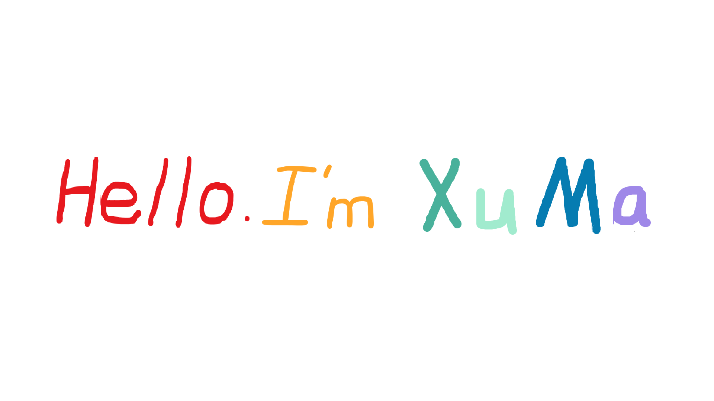

 

I'm a Student form NJUPT

**About me**

- 💼 As a Student at [NJUPT](https://www.njupt.edu.cn)

- ❤️ I love programing and reading

- 💬 Ask me about anything [here](https://github.com/mx-pai/mx-pai/issues)

<!--
**mx-pai/mx-pai** is a ✨ _special_ ✨ repository because its `README.md` (this file) appears on your GitHub profile.

Here are some ideas to get you started:

- 🔭 I’m currently working on ...
- 🌱 I’m currently learning ...
- 👯 I’m looking to collaborate on ...
- 🤔 I’m looking for help with ...
- 💬 Ask me about ...
- 📫 How to reach me: ...
- 😄 Pronouns: ...
- ⚡ Fun fact: ...
-->

