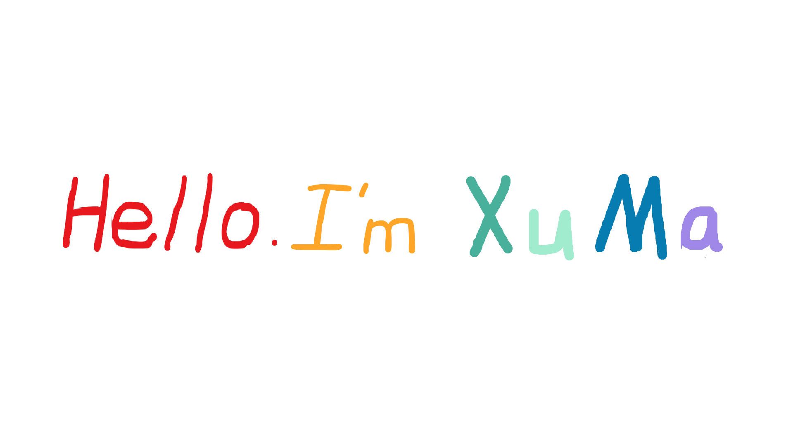

 

## Hi, I'm Ma Xu 👋

iOS & Apple Platforms Developer · CS @ NJUPT · Intern @ ByteDance

### About Me

I'm a Computer Science student at Nanjing University of Posts and Telecommunications, currently interning as an **iOS Client Developer at ByteDance**. I'm passionate about building polished, user-facing mobile applications and exploring how AI can enhance the developer and user experience.

### Tech Stack

| Domain | Technologies |
|--------|-------------|
| **Apple Platforms** | Swift · SwiftUI · UIKit · Objective-C · MapKit · Core Data · Xcode |
| **AI / ML** | Python · LLM Applications · RAG · Agent Systems |
| **Backend & Others** | Java · Kotlin · FastAPI · REST APIs · Docker · Git · CI/CD |

### Current Focus

- 📱 Native iOS development — SwiftUI + UIKit hybrid architecture, navigation patterns, accessibility
- 🤖 Building AI-powered tools and agents

### Links

